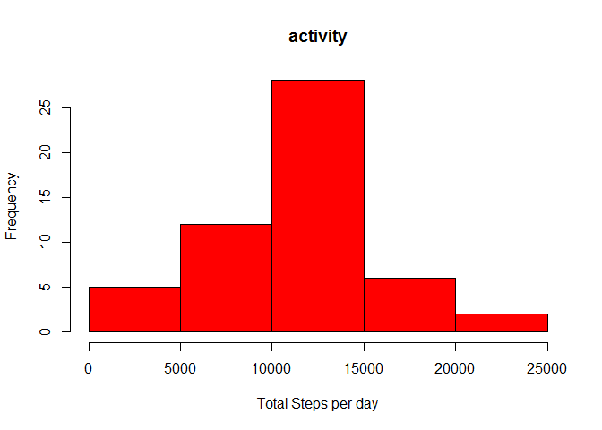
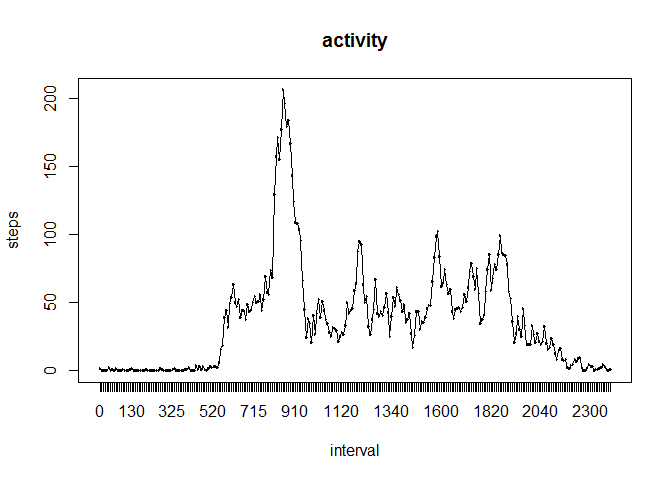
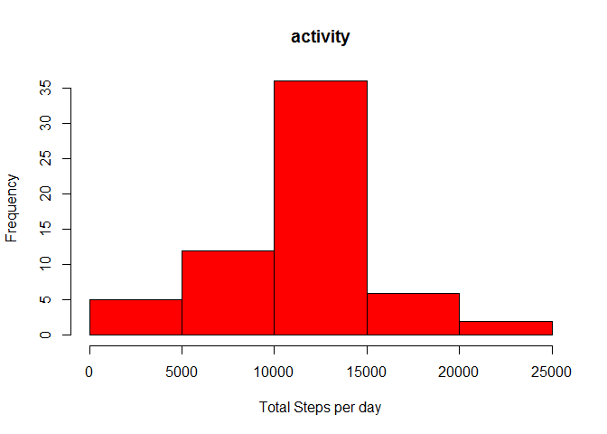
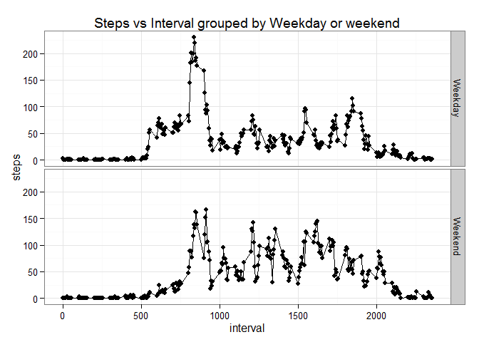

# Reproducible Research: Peer Assessment 1


## Loading and preprocessing the data

```r
#loading
temp<-'./activity.zip'
data<-read.csv(unz(temp,"activity.csv"),header=T,stringsAsFactors = F)
#pre-processing
data$date<-as.Date(data$date)
```

## What is mean total number of steps taken per day?

```r
#calculating total steps per day
totalsteps<-aggregate(steps~date,data,sum)
#Plotting histogram
hist(totalsteps$steps,col="red",xlab='Total Steps per day',main='activity')
```

 

```r
#Mean and median total steps per day
print(paste("Mean total steps per day is ",mean(totalsteps$steps),sep=" "))
```

```
## [1] "Mean total steps per day is  10766.1886792453"
```

```r
print(paste("Median total steps per day is ",median(totalsteps$steps),sep=" "))
```

```
## [1] "Median total steps per day is  10765"
```


## What is the average daily activity pattern?

```r
#Average daily activity pattern in 5 minute intervals
data2<-transform(data,interval=factor(interval))
interval_steps_mean<-aggregate(steps~interval,data2,mean)
#plotting daily activity patter
with(interval_steps_mean,plot(steps ~ interval,type="n",main='activity'))
with(interval_steps_mean,points(steps ~ interval,type="l"))
```

 

```r
#Calculating the interval where activity is maximum
max_interStart=interval_steps_mean$interval[which(interval_steps_mean$steps==max(interval_steps_mean$steps))]
max_interStart=as.numeric(levels(max_interStart))[max_interStart]
max_interEnd=max_interStart+4
print(paste("Time interval corresponding to maximum number of steps is",max_interStart,":",max_interEnd,sep=" "))
```

```
## [1] "Time interval corresponding to maximum number of steps is 835 : 839"
```

## Imputing missing values

```r
#number of missing values
print(paste("Number of missing values = ",sum(is.na(data$steps)),sep=" "))
```

```
## [1] "Number of missing values =  2304"
```

```r
#imputation
missing_inds=which(is.na(data$steps))
data_imp<-data
for (ind in missing_inds){
  data_imp[ind,"steps"]<-interval_steps_mean[interval_steps_mean$interval==data2[ind,"interval"],]$steps  
}
print("Imputed data set: data_imp")
```

```
## [1] "Imputed data set: data_imp"
```

```r
#Summary
totalsteps_imp<-aggregate(steps~date,data_imp,sum)
hist(totalsteps_imp$steps,col="red",xlab='Total Steps per day',main='activity')
```

 

```r
print(paste("Mean total steps per day is ",mean(totalsteps_imp$steps),sep=" "))
```

```
## [1] "Mean total steps per day is  10766.1886792453"
```

```r
print(paste("Median total steps per day is ",median(totalsteps_imp$steps),sep=" "))
```

```
## [1] "Median total steps per day is  10766.1886792453"
```

The strategy for missing value imputation used is as follows - for each missing value, the mean of the number of steps across all days for the corresponding 5 minute time interval is imputed.

The mean of total steps per day is the same value for the imputed data set as the original data set. The median
is however equal to the mean in the imputed data set, whereas it is different in the original data set. In the imputed
data set we assign each missing value to be equal to the mean of that 5 minute time interval, and hence the mean remains unchanged. The imputing of this mean value into the data however means that the median also becomes equal to the mean. The histogram of the imputed dataset is identical to the original except for the bin containing the mean value. Due to the multiple imputations of the mean value, the bin containing the mean value is higher in the imputed data set compared to the original dataset. Thus, we find that imputing missing values increases the sum of total value of the number of steps per day, however without affecting the mean of the total steps per day

## Are there differences in activity patterns between weekdays and weekends?

```r
#Adding the day and weekday/weekend variables to the data
data_imp_day<-data_imp
data_imp_day$day<-weekdays(data_imp_day$date)
wkends<-c("Saturday","Sunday")
data_imp_day$wkday<-factor(data_imp_day$day %in% wkends,labels=c("Weekday","Weekend"))
library(ggplot2)
```

```
## Warning: package 'ggplot2' was built under R version 3.1.3
```

```r
#plotting activity patterns for weekdays vs weekends
interval_steps_mean_wkday<-aggregate(steps~interval+wkday,data_imp_day,mean)
qplot(interval,steps,data = interval_steps_mean_wkday,facets= wkday~.)+geom_line()+theme_bw()+ggtitle('Steps vs Interval grouped by Weekday or weekend')
```

 

We see some differences between activity patterns on weekdays and weekends. On weekdays, there is a distinct peak of high activity, whereas it fluctuates considerably more on weekends
